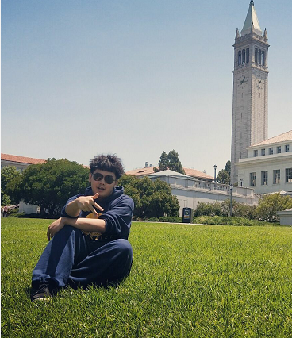

<table border="0">
  <tr>
    <td width="50%">
      <h1>ZhiyuXue</h1>
      
<b>Undergraduate Student</b>

      
<b>University of Electronic Science and Technology of China</b>

      
<b>xzy990228@gmail.com</b>

      
<b>Member of DIG Lab</b>

    </td>
    <td width="50%">
            
    </td>
  </tr>
</table>

## Research Interests
Few-shot learning, Meta Learning, Knowledge Distillation, Transfer Learning

## My Work

## Main Experience
DIG Lab 2018 - 2020 （https://www.baidu.com/link?url=34y5BjMt_xxWZH1NpkDzhjpUW-SMEtaf_4W5mCoNyui&wd=&eqid=dbda264e000fd842000000035e21483d）

Fintell Financial Service Company 2019.7 - 2018.8 （http://www.fintell.com.cn/）

  

